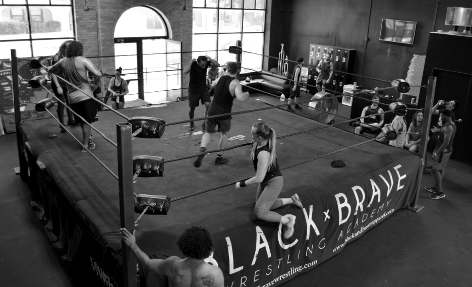

The Black x Brave Wrestling Academy has been developing talent since 2014. The facility, located in Davenport, Iowa, is equipped with a WWE ring and wide range of gym equipment.

## Where is Seth Rollins' Black x Brave Wrestling Academy located?
It is located in Davenport, Iowa. 

### Nearby Cities
* Des Moines, IA
* Cedar Rapids, IA
* Chicago, IL

### Does the Black x Brave Wrestling Academy offer housing/lodging for their trainees and students?
Yes! Students can rent bunks for $300 a month.

--- 

## Who are the Black x Brave Wrestling Academy Trainers?
* (Colby Lopez) Seth Rollins
* Marek Brave
* Matt Mayday

## Which pro wrestlers have trained at the Black x Brave Wrestling Academy?
* Nathan Frazer 
* Zicky Dice
* Frontman Jah

---

## What programs are offered at the Black x Brave Wrestling Academy?
They offer a 12 week program open to Men and Women, over the age of 18, to learn pro wrestling and also have access to open ring times and unlinmited access to QC Crossfit training.  
Students will also have the opportunity to help at local independent promotions, which will pay off 100x in networking alone, while also learning the behind the scenes of a show.

### 12 Week Program
* Tuesday 11am - 2pm
* Wednesday 11am - 2pm
* Thursday 11am - 2pm

*Students will have the opportunity to travel to independent promotions on the weekends

---

## How much does it cost to train at the Black x Brave Wrestling Academy?

### 12 Week Training (No Lodging)
* $3,500 USD Total
  * $1,750 USD within 30 days of acceptance
  * $1,750 USD within night 1 of training

### One Year Membership with payment plan (Juniors)
* $4,400 USD Total
  * $3,500 USD Total for training
    * $1,750 USD within 30 days of acceptance
    * $1,750 USD within night 1 of training
  * $900 for lodging
    * $300 x 3 months

#### Membership Breakdown
Price includes the use of the gym equipment at the facility, unlimited access to QC Crossfit training ($500 value), and access to ring times.

#### Price per class (No Lodging)
* 12 Week Training (3 day/week)
  * **$97.22** a class if you paid in full 

#### Price per class (Including Lodging)
* 12 Week Training (3 day/week)
  * **$122.22** a class if you paid in full  

---

## What other amenities are available at the World Famous Monster Factory?
* WWE ring
* Gym equipment
* Crossfit training
* Personal training outside of normal class hours

---

## Who can I contact?
[Sign up for Black x Brave Wrestling Academy on their website](https://www.blackandbravewrestling.com/new-page)

<YouTube youTubeId="pkXgahV-OSs" />
